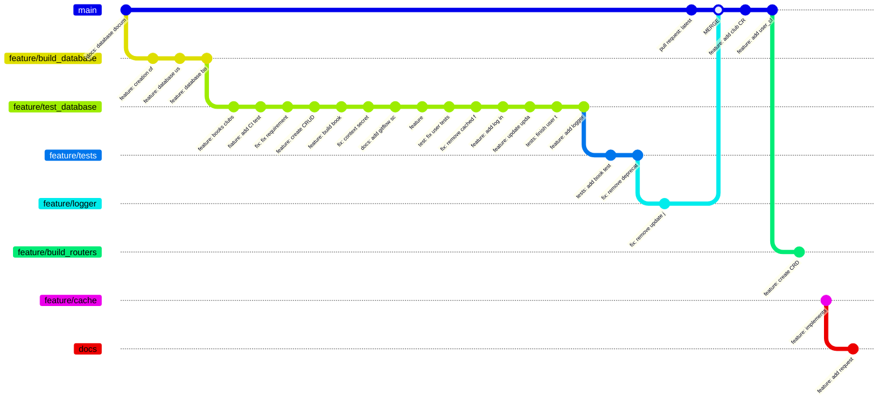

# BookBridge API Documentation

## Sumário
- [1. Visão Geral](#1-visão-geral)
- [2. Como Executar o Projeto](#2-como-executar-o-projeto)
- [3. Banco de Dados](#3-banco-de-dados)
- [4. Requisições No App](#4-requisições-no-app)
- [5. Organização GitHub](#5-organização-github)
- [6. Swagger](#6-swagger)

---

## 1. Visão Geral

O **BookBridge API** é um projeto desenvolvido para gerenciar livros, usuários e clubes de leitura. Ele oferece uma série de funcionalidades que facilitam o gerenciamento de dados relacionados a usuários e clubes de leitura, incluindo a adição de livros a clubes e a realização de avaliações. Este projeto utiliza tecnologias modernas para proporcionar eficiência e segurança.

### Principais funcionalidades:
- **CRUD de Usuários**: Permite criar, ler, atualizar e deletar usuários.
- **CRUD de Clube e Livros**: Funcionalidades para gerir clubes e livros.
- **Outros Endpoints**:
  - Adição e remoção de livros de clubes.
  - Realização de avaliações de livros.
- **Testes Unitários**: Implementação de testes para garantir a integridade do código.
- **Implementação de SQLAlchemy**: Para manipulação e gerenciamento do banco de dados.
- **Implementação de Cache**: Otimização do desempenho com `flask_caching`.
- **Implementação de JWT**: Para garantir a segurança através da autenticação.
- **Documentação via Swagger**: Interface amigável para visualização e teste dos endpoints.
- **Logs Detalhados**: Monitoramento de atividades com `current_app.logger`.
- **Modularidade**: Cada funcionalidade separada em *blueprints*.
- **Configuração Fácil**: Scripts e instruções para executar o projeto rapidamente.

---

## 2. Como Executar o Projeto

Este projeto foi configurado e testado no **Ubuntu 24.04-LTS**. O projeto pode ser executado com facilidade através de scripts de shell pré-configurados que facilitam a interação com o ambiente.

### Comandos principais:
- `./bookbridge.sh build`: Inicia um virtual enviroment e instala as dependencias.
- `./bookbridge.sh flask`: Executa o servidor Flask com a aplicação principal.
- `./bookbridge.sh test`: Roda todos os testes unitários configurados.

Para mais detalhes, consulte os comentários no script `bookbridge.sh`.

---

## 3. Banco de Dados

Neste projeto foi utilizado SQLAlchemy, uma framework de python para trbalahar com SQL, de forma segura, para garantiar a persistência de dados com commits e rollback, e segurança contra SQL Injection
### Modelos e Entidades

#### Usuario
Representa os usuários cadastrados na aplicação. Os atributos são:
- `id`: VARCHAR2(10), chave primária.
- `email`: VARCHAR2, obrigatório.
- `senha`: VARCHAR2, obrigatório.
- `nickname`: VARCHAR2, obrigatório.
- `nome`: VARCHAR2, obrigatório.
- `sobrenome`: VARCHAR2, obrigatório.

#### Clube
Representa um clube de leitura criado por um usuário. Os atributos são:
- `id`: VARCHAR2, chave primária.
- `criador`: VARCHAR2, chave estrangeira referenciando `Usuario`.
- `nome`: VARCHAR2, obrigatório.
- `description`: VARCHAR2, opcional.

#### Livro
Representa os livros que podem ser adicionados aos clubes de leitura. Os atributos são:
- `id`: VARCHAR2, chave primária.
- `autor`: VARCHAR2, obrigatório.
- `nome`: VARCHAR2, obrigatório.
- `genero`: VARCHAR2, opcional.

#### Avaliacao
Representa uma avaliação feita por um usuário sobre um livro. Os atributos são:
- `id`: VARCHAR2, chave primária.
- `avaliador`: VARCHAR2, chave estrangeira referenciando `Usuario`.
- `livro`: VARCHAR2, chave estrangeira referenciando `Livro`.
- `descricao`: VARCHAR2, opcional.
- `estrelas`: INTEGER, intervalo de 0 a 5, obrigatório.
- `data_avaliacao`: DATETIME, obrigatório.

### Relações

#### Criar Clube
**Tipo**: Relação (1:N) entre `Usuario` e `Clube`.

**Descrição**: Um usuário pode criar vários clubes de leitura, mas cada clube tem um único criador.

#### Participar de Clube
**Tipo**: Relação (N:N) entre `Usuario` e `Clube`.

**Descrição**: Um usuário pode participar de vários clubes de leitura, e um clube pode ter múltiplos usuários.

#### Adicionar Livro
**Tipo**: Relação (N:N:N) entre `Usuario`, `Clube` e `Livro`.

**Descrição**: Um usuário pode adicionar vários livros em diferentes clubes, mas um mesmo livro só pode ser adicionado uma vez em um clube.

#### Avaliar
**Tipo**: Relação (N:N) entre `Usuario` e `Livro`.

**Descrição**: Um usuário pode avaliar um livro, e um livro pode ser avaliado por vários usuários.

### Diagrama ER

---

## 4. Requisições No App

A seguir, uma visão geral de todos os endpoints disponíveis:

### Endpoints principais:
1. **Usuários**
   - **`POST /usuarios`**: Criação de um novo usuário | **Autenticação**: Não |
   - **`GET /usuarios`**: Retorna os dados do usuário logado | **Autenticação**: Sim |
   - **`PUT /usuarios`**: Atualiza os dados do usuário logado | **Autenticação**: Sim |
   - **`DELETE /usuarios`**: Deleta o usuário logado | **Autenticação**: Sim |

2. **Clubes**
   - **`POST /clubes`**: Criação de um novo clube | **Autenticação**: Sim |
   - **`GET /clubes/<club_id>`**: Busca um clube específico pelo seu ID | **Autenticação**: Não | **Essa função possui cacheamento** |
   - **`PUT /clubes/<club_id>`**: Atualiza os dados de um clube | **Autenticação**: Sim |
   - **`DELETE /clubes/<club_id>`**: Deleta um clube | **Autenticação**: Sim |

3. **Livros**
   - **`POST /livros`**: Adiciona um novo livro | **Autenticação**: Sim |
   - **`GET /livros/<livro_id>`**: Busca um livro específico | **Autenticação**: Não | **Essa função possui cacheamento** |
   - **`GET /livros/buscar`**: Busca livros por título, autor ou gênero | **Autenticação**: Não | **Essa função possui cacheamento** |
   - **`POST /livros/avaliar`**: Realiza uma avaliação de livro | **Autenticação**: Sim |

4. **Livros em Clubes**
   - **`POST /clube/livros`**: Adiciona um livro a um clube | **Autenticação**: Sim |
   - **`GET /clube/<clube_id>/livros`**: Lista livros de um clube | **Autenticação**: Não | **Essa função possui cacheamento** |
   - **`DELETE /clube/livros`**: Remove um livro de um clube | **Autenticação**: Sim |

### Observação:
Endpoints com cache apresentam maior desempenho em chamadas subsequentes. Para endpoints que exigem autenticação, o token JWT deve ser enviado no cabeçalho `Authorization` como `Bearer <token>`.

---

## 5. Organização GitHub

O projeto está organizado de forma modular para facilitar a manutenção e a escalabilidade. Cada  funcionalidade possui seu próprio diretório e arquivos relacionados. A estrutura inclui:

- `main`: Branch principal do projeto incluindo todas as features do projeto, no qual possui atualizações por meio de pull request.
- `docs`: Utilizada para fazer a documentação e implementação do Swagger.
- `feature/build_routers`: Utilizada para a construção das rotas da API.
- `feature/logger`: Utilizada para a implementação do LOG.
- `feature/tests`: Utilizada para a implementação de testes da API.
- `feature/test_database`: Utilizada para a implementação de testes do Banco de Dados.

### Visualização do Flow

---

## 6. Swagger

Aqui está uma captura de tela da documentação Swagger:

---