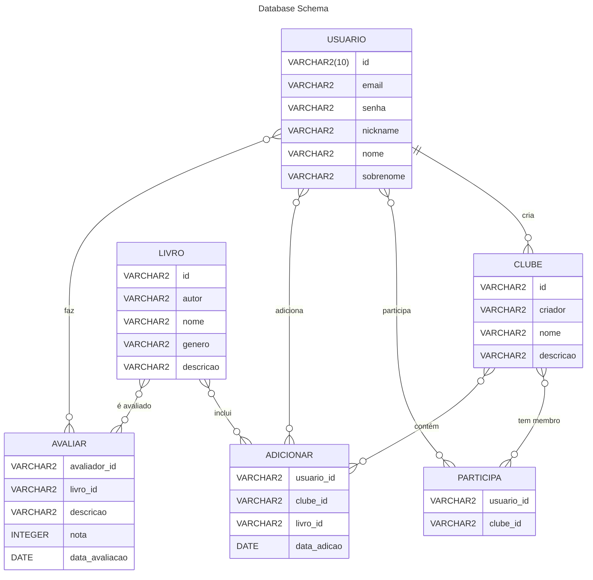
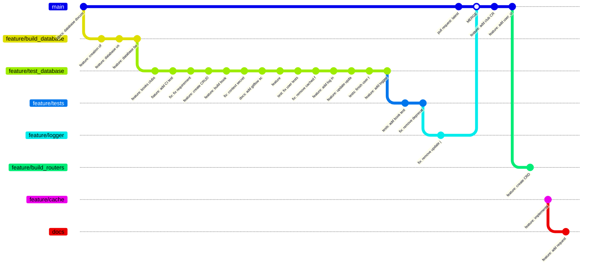
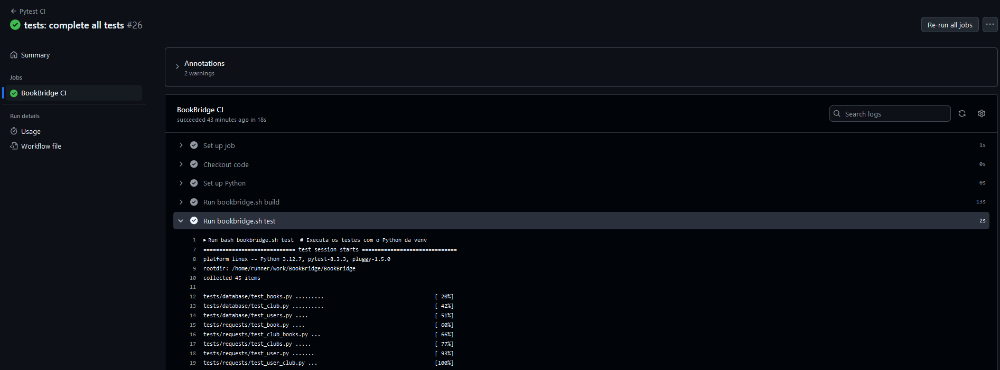
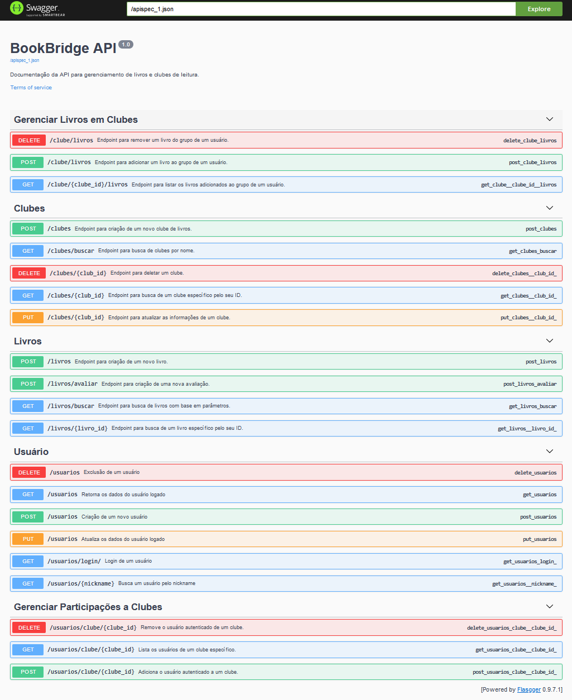

# BookBridge API Documentation

## Sumário
- [1. Visão Geral](#1-visão-geral)
- [2. Como Executar o Projeto](#2-como-executar-o-projeto)
- [3. Banco de Dados](#3-banco-de-dados)
- [4. Requisições No App](#4-requisições-no-app)
- [5. Organização GitHub](#5-organização-github)
- [6. Swagger](#6-swagger)

---

## 1. Visão Geral

O **BookBridge API** é um projeto desenvolvido para gerenciar livros, usuários e clubes de leitura. Ele oferece uma série de funcionalidades que facilitam o gerenciamento de dados relacionados a usuários e clubes de leitura, incluindo a adição de livros a clubes e a realização de avaliações. Este projeto utiliza tecnologias modernas para proporcionar eficiência e segurança.

### Principais funcionalidades:
- **CRUD de Usuários**: Permite criar, ler, atualizar e deletar usuários.
- **CRUD de Clube e Livros**: Funcionalidades para gerir clubes e livros.
- **Outros Endpoints**:
  - Adição e remoção de livros de clubes.
  - Realização de avaliações de livros.
- **Testes Unitários**: Implementação de testes para garantir a integridade do código.
- **Implementação de SQLAlchemy**: Para manipulação e gerenciamento do banco de dados.
- **Implementação de Cache**: Otimização do desempenho com `flask_caching`.
- **Implementação de JWT**: Para garantir a segurança através da autenticação.
- **Documentação via Swagger**: Interface amigável para visualização e teste dos endpoints.
- **Logs Detalhados**: Monitoramento de atividades com `current_app.logger`.
- **Modularidade**: Cada funcionalidade separada em *blueprints*.
- **Configuração Fácil**: Scripts e instruções para executar o projeto rapidamente.

---

## 2. Como Executar o Projeto

Este projeto foi configurado e testado no **Ubuntu 24.04-LTS**. O projeto pode ser executado com facilidade através de scripts de shell pré-configurados que facilitam a interação com o ambiente.

### Comandos principais:
```sh 
./bookbridge.sh build # Inicia um virtual enviroment e instala as dependencias.
```
```sh
./bookbridge.sh flask #  Executa o servidor Flask com a aplicação principal.
```
```sh
./bookbridge.sh test #  Roda todos os testes unitários configurados.
```

Para mais detalhes, consulte os comentários no script `bookbridge.sh`.

O projeto pode ser executado de outra forma, mas é preferível que seja executado pelo script, afim de preservar os dados do ambiente virtual. Você pode executar desta forma:

```sh
pip install -r requirements.txt # Instalacao das dependencias
```

```sh
python3 src.app # Inicia o app Flask
```

```sh
pytest tests/
```

Lembrando que é recomendado que seja executado utilizando o script shell
---


## 3. Banco de Dados

Neste projeto foi utilizado SQLAlchemy, uma framework de python para trbalahar com SQL, de forma segura, para garantiar a persistência de dados com commits e rollback, e segurança contra SQL Injection

### Modelos e Entidades

#### Usuario
Representa os usuários cadastrados na aplicação. Os atributos são:
- `id`: VARCHAR2(10), chave primária.
- `email`: VARCHAR2, obrigatório.
- `senha`: VARCHAR2, obrigatório.
- `nickname`: VARCHAR2, obrigatório.
- `nome`: VARCHAR2, obrigatório.
- `sobrenome`: VARCHAR2, obrigatório.

#### Clube
Representa um clube de leitura criado por um usuário. Os atributos são:
- `id`: VARCHAR2, chave primária.
- `criador`: VARCHAR2, chave estrangeira referenciando `Usuario`.
- `nome`: VARCHAR2, obrigatório.
- `descricao`: VARCHAR2, opcional.

#### Livro
Representa os livros que podem ser adicionados aos clubes de leitura. Os atributos são:
- `id`: VARCHAR2, chave primária.
- `autor`: VARCHAR2, obrigatório.
- `nome`: VARCHAR2, obrigatório.
- `genero`: VARCHAR2, opcional.

#### Avaliacao
Representa uma avaliação feita por um usuário sobre um livro. Os atributos são:
- `id`: VARCHAR2, chave primária.
- `avaliador`: VARCHAR2, chave estrangeira referenciando `Usuario`.
- `livro`: VARCHAR2, chave estrangeira referenciando `Livro`.
- `descricao`: VARCHAR2, opcional.
- `estrelas`: INTEGER, intervalo de 0 a 5, obrigatório.
- `data_avaliacao`: DATETIME, obrigatório.

### Relações

#### Criar Clube
**Tipo**: Relação (1:N) entre `Usuario` e `Clube`.

**Descrição**: Um usuário pode criar vários clubes de leitura, mas cada clube tem um único criador.

#### Participar de Clube
**Tipo**: Relação (N:N) entre `Usuario` e `Clube`.

**Descrição**: Um usuário pode participar de vários clubes de leitura, e um clube pode ter múltiplos usuários.

#### Adicionar Livro
**Tipo**: Relação (N:N:N) entre `Usuario`, `Clube` e `Livro`.

**Descrição**: Um usuário pode adicionar vários livros em diferentes clubes, mas um mesmo livro só pode ser adicionado uma vez em um clube.

#### Avaliar
**Tipo**: Relação (N:N) entre `Usuario` e `Livro`.

**Descrição**: Um usuário pode avaliar um livro, e um livro pode ser avaliado por vários usuários.

### Diagrama ER

---

## 4. Requisições No App

A seguir, uma visão geral de todos os endpoints disponíveis:

### Endpoints principais:

1. **Usuários**

   - **`POST /usuarios`**

     Descrição: Criação de um novo usuário.

     Parâmetros:

     - **Body**:

       - `email` (string): Exemplo: "exemplo@dominio.com"
       - `senha` (string): Exemplo: "Senha@123"
       - `nickname` (string): Exemplo: "apelido123"
       - `nome` (string): Exemplo: "João"
       - `sobrenome` (string): Exemplo: "Silva"

     Retorno:

     - **Status Code 201**: Usuário criado com sucesso.
     - **Status Code 401**: E-mail ou nickname já cadastrado.
     - **Status Code 403**: Campo(s) não preenchido(s) corretamente.
     - **Status Code 500**: Erro interno no servidor.

   - **`GET /usuarios/login/`**

     Descrição: Login de um usuário.

     Parâmetros:

     - **Body**:

       - `email` (string): Exemplo: "usuario@example.com"
       - `nickname` (string): Exemplo: "user123"
       - `senha` (string): Exemplo: "Senha@123"

     Retorno:

     - **Status Code 200**: Login realizado com sucesso.
       - **Corpo da resposta**:
         - `token` (string)
     - **Status Code 401**: Email, nickname ou senha incorretos.
     - **Status Code 500**: Erro interno no servidor.

   - **`GET /usuarios`** | Requer Autenticação

     Descrição: Retorna os dados do usuário logado.

     Parâmetros:

     - **Header**:
       - `Authorization` (string): Token de autenticação (formato Bearer token).

     Retorno:

     - **Status Code 200**: Dados do usuário retornados com sucesso.
     - **Status Code 401**: Token expirado.
     - **Status Code 403**: Token de autenticação inválido.
     - **Status Code 500**: Erro durante a listagem dos dados do usuário.

   - **`PUT /usuarios`** | Requer Autenticação

     Descrição: Atualiza os dados do usuário logado.

     Parâmetros:

     - **Header**:
       - `Authorization` (string): Token de autenticação (formato Bearer token).
     - **Body**:
       - `email` (string): Exemplo: "novoemail@example.com"
       - `senha` (string): Exemplo: "NovaSenha@123"
       - `nickname` (string): Exemplo: "novonick123"
       - `nome` (string): Exemplo: "NovoNome"
       - `sobrenome` (string): Exemplo: "NovoSobrenome"

     Retorno:

     - **Status Code 200**: Usuário atualizado com sucesso.
       - **Corpo da resposta**:
         - `message` (string)
         - `atualizados` (array de strings)
         - `erros` (array de strings)
     - **Status Code 400**: Não foi possível atualizar os campos.
     - **Status Code 401**: Token expirado.
     - **Status Code 403**: Token de autenticação inválido.
     - **Status Code 500**: Erro durante a atualização dos dados.

   - **`DELETE /usuarios`** | Requer Autenticação

     Descrição: Exclusão de um usuário.

     Parâmetros:

     - **Header**:
       - `Authorization` (string): Token de autenticação (formato Bearer token).

     Retorno:

     - **Status Code 200**: Usuário excluído com sucesso.
     - **Status Code 401**: Token expirado.
     - **Status Code 403**: Token de autenticação inválido.
     - **Status Code 500**: Erro durante a exclusão do usuário.

   - **`GET /usuarios/<nickname>`** | Requer Autenticação | Contém Cache

     Descrição: Busca um usuário pelo nickname.

     Parâmetros:

     - **Header**:
       - `Authorization` (string): Token de autenticação (formato Bearer token).
     - **Path**:
       - `nickname` (string): Nickname do usuário.

     Retorno:

     - **Status Code 200**: Usuário encontrado com sucesso.
     - **Status Code 401**: Token expirado.
     - **Status Code 403**: Token de autenticação inválido.
     - **Status Code 404**: Usuário não encontrado.
     - **Status Code 500**: Erro durante a busca do usuário.

2. **Livros**

   - **`POST /livros`** | Requer Autenticação

     Descrição: Criação de um novo livro.

     Parâmetros:

     - **Header**:
       - `Authorization` (string): Token de autenticação do usuário.
     - **Body**:
       - `nome` (string): Exemplo: "Dom Casmurro"
       - `autor` (string): Exemplo: "Machado de Assis"
       - `genero` (string): Exemplo: "Romance"
       - `descricao` (string): Exemplo: "Um clássico da literatura brasileira."

     Retorno:

     - **Status Code 201**: Livro criado com sucesso.
     - **Status Code 400**: Campo de entrada não preenchido.
     - **Status Code 401**: Token de autenticação expirado.
     - **Status Code 403**: Token de autenticação inválido.
     - **Status Code 500**: Erro ao criar o livro.

   - **`GET /livros/<livro_id>`** | Contém Cache

     Descrição: Busca de um livro específico pelo seu ID.

     Parâmetros:

     - **Path**:
       - `livro_id` (string): ID do livro.

     Retorno:

     - **Status Code 200**: Dados do livro retornados com sucesso.
     - **Status Code 404**: Livro não encontrado.
     - **Status Code 500**: Erro durante a busca do livro.

   - **`GET /livros/buscar`**

     Descrição: Busca de livros com base em parâmetros.

     Parâmetros:

     - **Query**:
       - `nome` (string): Título do livro.
       - `autor` (string): Autor do livro.
       - `genero` (string): Gênero do livro.

     Retorno:

     - **Status Code 200**: Livros retornados com sucesso.
       - **Corpo da resposta**:
         - `livros` (array de objetos com `id`, `nome`, `autor`, `genero`)
     - **Status Code 400**: Parâmetros de busca inválidos.
     - **Status Code 500**: Erro durante a busca dos livros.

   - **`POST /livros/avaliar`** | Requer Autenticação

     Descrição: Criação de uma nova avaliação.

     Parâmetros:

     - **Header**:
       - `Authorization` (string): Token de autenticação do usuário.
     - **Body**:
       - `livro_id` (string): Exemplo: "12345"
       - `descricao` (string): Exemplo: "Excelente livro!"
       - `estrelas` (inteiro): Exemplo: 5

     Retorno:

     - **Status Code 201**: Avaliação criada com sucesso.
     - **Status Code 400**: Campo de entrada não preenchido ou incorreto.
     - **Status Code 401**: Token de autenticação expirado.
     - **Status Code 403**: Token de autenticação inválido.
     - **Status Code 404**: Livro não encontrado.
     - **Status Code 500**: Erro ao criar a avaliação.

3. **Clubes**

   - **`POST /clubes`** | Requer Autenticação

     Descrição: Criação de um novo clube de livros.

     Parâmetros:

     - **Header**:
       - `Authorization` (string): Token de autenticação do usuário.
     - **Body**:
       - `nome` (string): Exemplo: "Clube de Ficção Científica"
       - `descricao` (string): Exemplo: "Clube para discutir livros de ficção científica."

     Retorno:

     - **Status Code 201**: Clube de livros criado com sucesso.
       - **Corpo da resposta**:
         - `message` (string): "Clube de Livros Criado com Sucesso!"
     - **Status Code 400**: Erro de validação.
     - **Status Code 403**: Usuário não autenticado.
     - **Status Code 500**: Erro ao tentar salvar o clube.

   - **`GET /clubes/<club_id>`** | Contém Cache

     Descrição: Busca de um clube específico pelo seu ID.

     Parâmetros:

     - **Path**:
       - `club_id` (string): ID do clube a ser buscado.

     Retorno:

     - **Status Code 200**: Dados do clube retornados com sucesso.
     - **Status Code 404**: Clube não encontrado.
     - **Status Code 500**: Erro interno ao buscar clube.

   - **`PUT /clubes/<club_id>`** | Requer Autenticação

     Descrição: Atualiza as informações de um clube.

     Parâmetros:

     - **Header**:
       - `Authorization` (string): Token de autenticação do usuário.
     - **Path**:
       - `club_id` (string): ID do clube a ser atualizado.
     - **Body**:
       - `nome` (string): Exemplo: "Novo Nome do Clube"
       - `descricao` (string): Exemplo: "Descrição atualizada do clube."

     Retorno:

     - **Status Code 200**: Clube atualizado com sucesso.
     - **Status Code 403**: Usuário não é criador do clube.
     - **Status Code 404**: Clube não encontrado.
     - **Status Code 500**: Erro ao tentar atualizar o clube.

   - **`DELETE /clubes/<club_id>`** | Requer Autenticação

     Descrição: Deleta um clube.

     Parâmetros:

     - **Header**:
       - `Authorization` (string): Token de autenticação do usuário.
     - **Path**:
       - `club_id` (string): ID do clube a ser deletado.

     Retorno:

     - **Status Code 200**: Clube deletado com sucesso.
     - **Status Code 403**: Usuário não é criador do clube.
     - **Status Code 404**: Clube não encontrado.
     - **Status Code 500**: Erro ao tentar deletar o clube.

4. **Livros em Clubes**

   - **`POST /clube/livros`** | Requer Autenticação

     Descrição: Adiciona um livro ao grupo de um usuário.

     Parâmetros:

     - **Header**:
       - `Authorization` (string): Token de autenticação do usuário.
     - **Body**:
       - `clube_id` (string): Exemplo: "12345"
       - `livro_id` (string): Exemplo: "67890"

     Retorno:

     - **Status Code 200**: Livro adicionado com sucesso ao grupo.
     - **Status Code 400**: Campo de entrada não preenchido.
     - **Status Code 403**: Usuário não participa do clube.
     - **Status Code 404**: Clube ou livro não encontrado.
     - **Status Code 500**: Erro ao adicionar o livro ao grupo.

   - **`GET /clube/<clube_id>/livros`** | Contém Cache

     Descrição: Lista os livros adicionados ao grupo de um usuário.

     Parâmetros:

     - **Path**:
       - `clube_id` (string): Identificação do Clube.

     Retorno:

     - **Status Code 200**: Livros encontrados com sucesso no clube.
       - **Corpo da resposta**:
         - `books` (array de objetos com `id`, `nome`, `autor`, `media_avaliacoes`)
     - **Status Code 404**: Clube não encontrado.
     - **Status Code 500**: Erro ao buscar livros do clube.

   - **`DELETE /clube/livros`** | Requer Autenticação

     Descrição: Remove um livro do grupo de um usuário.

     Parâmetros:

     - **Header**:
       - `Authorization` (string): Token de autenticação do usuário.
     - **Body**:
       - `clube_id` (string): Exemplo: "12345"
       - `livro_id` (string): Exemplo: "67890"

     Retorno:

     - **Status Code 200**: Livro removido com sucesso do grupo.
     - **Status Code 400**: Campo de entrada não preenchido.
     - **Status Code 403**: Usuário não participa do clube.
     - **Status Code 404**: Clube ou livro não encontrado.
     - **Status Code 500**: Erro ao remover o livro do grupo.

5. **Usuários em Clubes**

   - **`POST /usuarios/clube/<clube_id>`** | Requer Autenticação

     Descrição: Adiciona o usuário autenticado a um clube.

     Parâmetros:

     - **Header**:
       - `Authorization` (string): Token de autenticação do usuário.
     - **Path**:
       - `clube_id` (string): Identificação do Clube.

     Retorno:

     - **Status Code 201**: Participação adicionada com sucesso.
     - **Status Code 404**: Clube não encontrado.
     - **Status Code 409**: Registro de participação já existente.
     - **Status Code 500**: Erro interno ao salvar participação.

   - **`GET /usuarios/clube/<clube_id>`** | Contém Cache

     Descrição: Lista os usuários de um clube específico.

     Parâmetros:

     - **Path**:
       - `clube_id` (string): Identificação do Clube.

     Retorno:

     - **Status Code 200**: Usuários encontrados no clube.
       - **Corpo da resposta**:
         - `users` (array de objetos com `id`, `nome`, `sobrenome`)
     - **Status Code 404**: Clube não encontrado.
     - **Status Code 500**: Erro interno no servidor.

   - **`DELETE /usuarios/clube/<clube_id>`** | Requer Autenticação

     Descrição: Remove o usuário autenticado de um clube.

     Parâmetros:

     - **Header**:
       - `Authorization` (string): Token de autenticação do usuário.
     - **Path**:
       - `clube_id` (string): Identificação do Clube.

     Retorno:

     - **Status Code 200**: Participação removida com sucesso.
     - **Status Code 404**: Clube ou registro de participação não encontrado.
     - **Status Code 500**: Erro ao tentar remover participação.


### Observação:
Endpoints com cache apresentam maior desempenho em chamadas subsequentes. Para endpoints que exigem autenticação, o token JWT deve ser enviado no cabeçalho `Authorization` como `Bearer <token>`.

---

## 5. Organização GitHub

O projeto está organizado de forma modular para facilitar a manutenção e a escalabilidade. Cada  funcionalidade possui seu próprio diretório e arquivos relacionados. A estrutura inclui:

### Branches

- `main`: Branch principal do projeto incluindo todas as features do projeto, no qual possui atualizações por meio de pull request.
- `docs`: Utilizada para fazer a documentação e implementação do Swagger.
- `feature/build_routers`: Utilizada para a construção das rotas da API.
- `feature/logger`: Utilizada para a implementação do LOG.
- `feature/tests`: Utilizada para a implementação de testes da API.
- `feature/test_database`: Utilizada para a implementação de testes do Banco de Dados.

Também foi implementado um fluxo de CI para verificação do código, que baixa as dependencias e executa os testes unitários.

### Visualização do Flow


### Implementação de CI com Pytest

Foi implementado um Git Action para a automação e realização dos testes, para preservar a integridade de cada commit e verificar se as alterações não afetaram o desenvolvimento da aplicação



---

## 6. Swagger

Aqui está uma captura de tela da documentação Swagger:



---