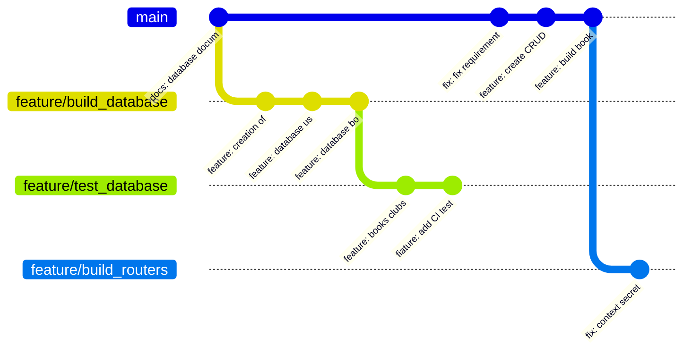

# Organização de Fluxo no GitHub

```mermaid
gitGraph
    commit id:"docs: database docum"
    branch feature/build_database
    commit id:"feature: creation of"
    commit id:"feature: database us"
    commit id:"feature: database bo"
    branch feature/test_database
    commit id:"feature: books clubs"
    commit id:"fiature: add CI test"
    checkout main
    commit id:"fix: fix requirement"
    commit id:"feature: create CRUD"
    commit id:"feature: build book "
    branch feature/build_routers
    checkout feature/build_routers
    commit id:"fix: context secret "


```